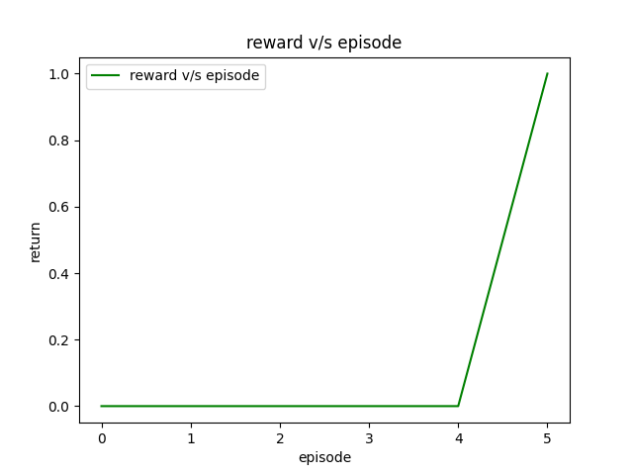
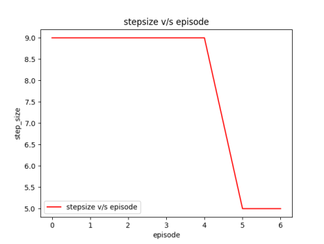

# Deep Reinforcement Learning — Summer Internship @ IVLabs (2024)

Implementations of classical and deep reinforcement learning algorithms, built and trained from scratch during my summer research internship at **IVLabs**. The work progresses from tabular methods on toy environments to policy-gradient deep RL in a 3D game engine — with experiments comparing convergence, stability, and sample efficiency at each stage.

| Environment | Algorithms |
|---|---|
| FrozenLake (Gym) | Value Iteration, Policy Iteration, Monte Carlo, SARSA(λ) |
| MiniGrid | Monte Carlo, SARSA(λ), Q-learning |
| ViZDoom | DQN, PPO |

---

## Task 1 — FrozenLake: Dynamic Programming


**Objective:** navigate a slippery frozen grid to the goal while avoiding holes.

- **Value Iteration** — iteratively backs up state values with the Bellman Optimality Equation until convergence, then extracts the greedy policy.
- **Policy Iteration** — alternates policy evaluation (computing the value function under the current policy) with greedy policy improvement.

**Findings:** with access to the full transition model, dynamic programming converged quickly to the optimal policy on the deterministic map. Model-free methods (Monte Carlo, SARSA(λ)) needed far more exploration and hyperparameter tuning to stay competitive on the stochastic version.

 

## Task 2 — MiniGrid: Model-Free Tabular Methods


**Objective:** learn to reach the goal in a partially observable grid world, without a model of the environment.

### Monte Carlo control
Collects full-episode returns, averages them per state–action pair (first-visit), and improves an ε-greedy policy. Worked well on small grids but needed many episodes to converge.

### SARSA(λ)
On-policy TD learning with **eligibility traces**, which propagate credit back through recent state–action pairs. This gave the most stable learning under partial observability — at the cost of careful λ tuning.

### Q-learning
Off-policy TD control that bootstraps directly on the max Q-value. Converged fastest in fully observable regions but struggled where long action sequences mattered.

**Takeaway:** the three methods trade off convergence speed against stability — Q-learning learns fastest when the state is fully visible, while SARSA(λ)'s traces handle partial observability more gracefully.

## Task 3 — ViZDoom: Deep RL (DQN & PPO)


**Objective:** train agents to navigate a 3D environment, engage enemies, and collect resources directly from raw game frames.

**PPO implementation highlights:**

- **Actor–critic architecture** — CNN-based policy and value networks processing stacked game frames
- **Advantage estimation** — advantages computed from observed returns vs. value estimates to drive policy updates
- **Clipped surrogate objective** — probability ratios are clipped each update, keeping the new policy close to the old one for stable learning

**Findings:** PPO learned robust behaviour noticeably faster than DQN, handling the large visual state space and delivering better sample efficiency across combat and resource-collection scenarios.

---

## Repository Structure

```
├── FrozenLake/   # DP, Monte Carlo, SARSA(λ) notebooks & training curves
├── Minigrid/     # MC, SARSA(λ), Q-learning implementations
└── VizDoom/      # DQN and PPO agents
```
